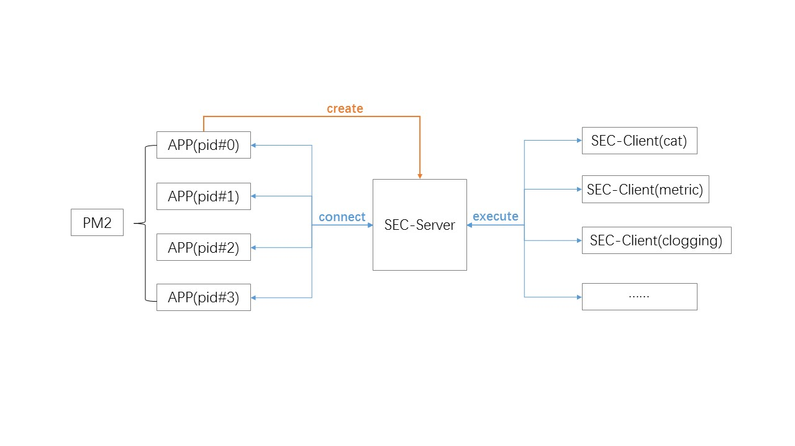

A Secretary for your node APP

# 使用场景
在app中经常会有发送日志等操作，app主逻辑和日志是相对独立两个模块。当app崩溃或者异常退出，会导致日志无法正常发送出去。同时，日志等发送的逻辑如果出错也会影响app的运行。

为此设计了一套模式（部分思路参照egg-cluster）。将发送日志作为一个Secretary（小秘书），app只需要发送一条日志指令给sec，日志发送的逻辑处理均在sec中处理。



# 使用API
在app中
```
var sec = require("agent.client.js");
sec.send({
    "your_log_worker.js", //处理日志的逻辑代码（需要从app中独立出来）
    {},                   //初始化your_log_worker.js的配置
    {
        method:"log_worker_function_api",  //调用的api名称
        params:[data]                      //调用的api参数
    }
});
```
# 发送日志的app demo
可以参考demo目录下，log_server和log_worker。

log_worker是用来接受socket消息的，类似于桥接的效果。如何处理可以根据自己的逻辑来写。
log_server是我的示例写法，可以定义一些方法，由app来调用。

可以运行index.js来查看效果。

# 退出时的处理
在app异常退出时，会发送一个exit的信号给sec（这里用的是[graceful](https://github.com/feifeipan/childprocess-exit)）。在log_server中声明一个beforeProcessExit的方法，用来处理一些退出之前的事情。


